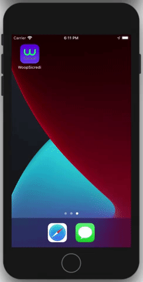

# Woop Eventos

### Descrição do Projeto:

Projeto desenvolvido para listagem e detalhes de eventos patrocinados pelo Sicredi.


1. Funcionalidades desenvolvidas
2. Telas e fluxos
3. Instalação
4. Referências consultadas para o desenvolvimento

### 1 - Funcionalidades desenvolvidas

- Lista de eventos
- Numero de participantes do evento
- Data do evento
- Distância do usuário até o evento
- Detalhes do evento
- Mapa do evento
- Manifestar interesse no evento
- Compartilhar detalhes do evento
- Auto-layout e Dark Mode


### 2 - Telas e fluxos
#### Light Mode


#### Dark Mode


#### Fluxo sem erros


#### Fluxo tratamento de erros




### 3 - Instalação
Clonar o repositório com o comando:

```
$ git clone https://github.com/alexandrebing/SicrediWoop
```

Acessar o diretório do projeto:

```
$ cd WoopSicredi/
```


Instalar as dependências:

```
$ pod install
```

Executar o arquivo `WoopSicredi.xcworkspace`


### 4 - Referências consultadas para o desenvolvimento

[MVVM RxSwift Practical Example App | Part One: Project Setup & Coordinator | iOS 13+ | Xcode 11+](https://www.youtube.com/watch?v=Dentp0JUbyI)

[API Client with RxSwift](https://medium.com/eonfluxor/api-client-with-rxswift-fe241196d124)

[RxSwift: Reactive Programming with Swift](https://www.raywenderlich.com/books/rxswift-reactive-programming-with-swift/v4.0)

[RxSwift Errors Done Right!](https://medium.com/@hello_84886/rxswift-errors-done-right-5284f4d7c063)